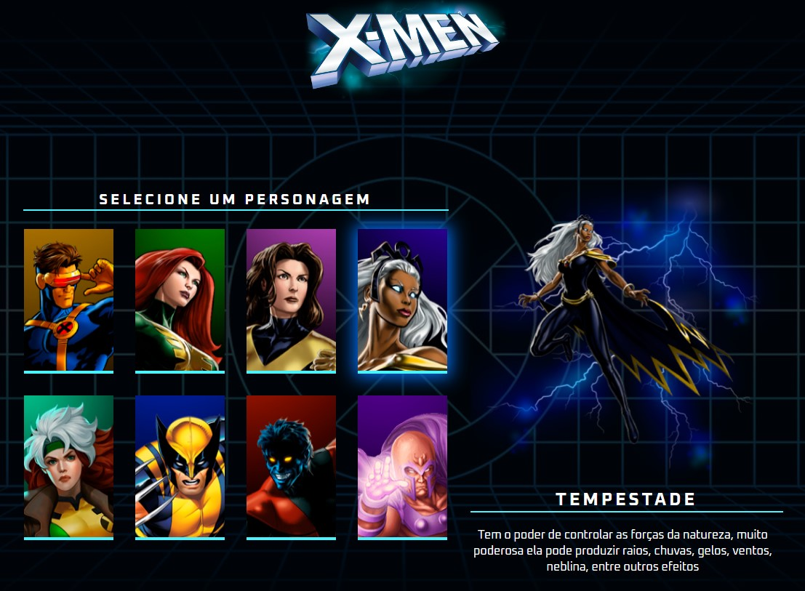

[![Contributors][contributors-shield]][contributors-url]
[![Forks][forks-shield]][forks-url]
[![Stargazers][stars-shield]][stars-url]
[![Issues][issues-shield]][issues-url]
[![MIT License][license-shield]][license-url]
[![LinkedIn][linkedin-shield]][linkedin-url]

<h3 align="center">Projetos Estudo</h3>

<!-- TABLE OF CONTENTS -->

  
Conteúdo

  <ol>
    <li>
      <a href="#Sobre-o-projeto">Sobre o Projeto</a>
    </li>
   <li><a href="#Tecnologias">Tecnologias</a></li>
    <li><a href="#Branches">Branches</a></li>
    <li><a href="#contatos">Contatos</a></li>
    <li><a href="#Agradecimentos">Agradecimentos</a></li>
  </ol>

<!-- ABOUT THE PROJECT -->

## Sobre o Projeto

Projeto criado para aprendizagem da linguagem HTML, CSS, e Javascript do curso devem dobro.
Com o intuito de aprendizado não foram feitas modificações nas funcionalidades além do que foi apresentado no treinamento.

<h4>Tela Inicial</h4>
Tela criação Todo

 

(<a href="#top">back to top</a>)

## Tecnologias

<!-- CONTACT -->

## Contatos

Marcos Araujo - [@linkedIn](https://www.linkedin.com/in/marcosaraujosouza/) - marcos.araso@hotmail.com

Project Link: [https://github.com/marcosaraujo-dev/CGS.ToDo](https://github.com/marcosaraujo-dev/CGS.ToDo)

(<a href="#top">back to top</a>)

<!-- ACKNOWLEDGMENTS -->

## Agradecimentos

- [DevEmDobro](https://www.youtube.com/@DevemDobro)

(<a href="#top">back to top</a>)

<!-- MARKDOWN LINKS & IMAGES -->
<!-- https://www.markdownguide.org/basic-syntax/#reference-style-links -->

[contributors-shield]: https://img.shields.io/github/contributors/marcosaraujo-dev/DevEmDobro.svg?style=for-the-badge
[contributors-url]: https://github.com/marcosaraujo-dev/DevEmDobro/graphs/contributors
[forks-shield]: https://img.shields.io/github/forks/marcosaraujo-dev/DevEmDobro.svg?style=for-the-badge
[forks-url]: https://github.com/marcosaraujo-dev/DevEmDobro/network/members
[stars-shield]: https://img.shields.io/github/stars/marcosaraujo-dev/DevEmDobro.svg?style=for-the-badge
[stars-url]: https://github.com/marcosaraujo-dev/DevEmDobro/stargazers
[issues-shield]: https://img.shields.io/github/issues/marcosaraujo-dev/DevEmDobro.svg?style=for-the-badge
[issues-url]: https://github.com/marcosaraujo-dev/DevEmDobro/issues
[license-shield]: https://img.shields.io/github/license/marcosaraujo-dev/DevEmDobro.svg?style=for-the-badge
[license-url]: https://github.com/marcosaraujo-dev/DevEmDobro/blob/master/LICENSE.txt
[linkedin-shield]: https://img.shields.io/badge/-LinkedIn-black.svg?style=for-the-badge&logo=linkedin&colorB=555
[linkedin-url]: https://www.linkedin.com/in/marcosaraujosouza/
